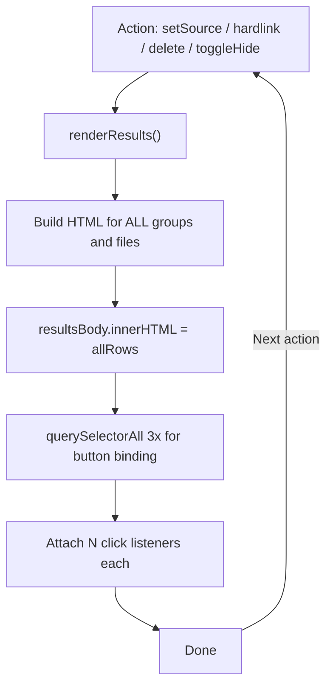
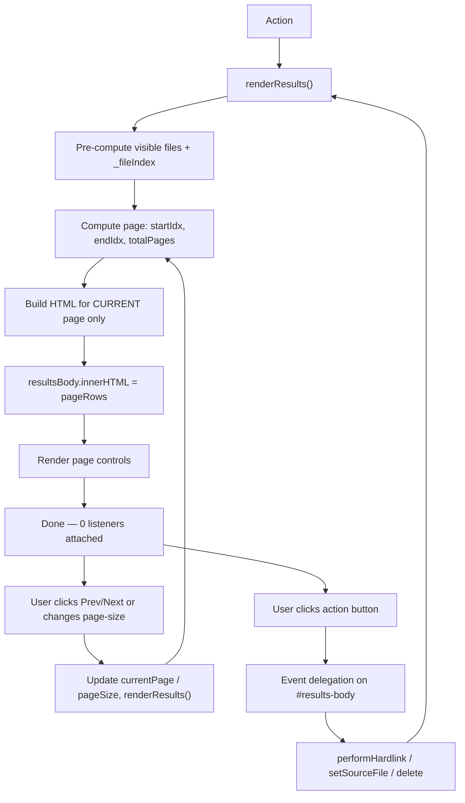

# czkawka_web — Results Rendering Performance Optimization

## Problem Analysis

[`renderResults()`](czkawka_web/web/app.js:418) is the sole bottleneck:

1. **All-at-once HTML construction** — lines 482–627 build HTML strings for every single group and file, then line 629 injects everything via `innerHTML`. With thousands of files, this single `innerHTML` assignment blocks the main thread for hundreds of milliseconds.

2. **Per-button event listeners** — lines 632–654 run three separate `querySelectorAll` calls (`.set-source-btn`, `.source-active-btn`, `.hardlink-btn`) and attach individual click handlers. For 1000 files × 3 buttons = 3000 listeners.

3. **Full re-render cascade** — any action (set source, hardlink, delete, toggle hide-linked) calls `renderResults()` which rebuilds everything from scratch, re-triggering all costs.

---

## Solution Overview

Two independent but complementary changes:

| Change | Effort | Impact | Complexity |
|--------|--------|--------|------------|
| Event delegation | Trivial (edit ~20 lines) | Eliminates 3000+ listeners | Low |
| Client-side pagination | Moderate (~90 lines) | Reduces DOM from 2000+ rows to ≤100 | Medium |

**Virtual scrolling** is rejected as overkill — the result table is a grouped structure (headers + file rows), making viewport calculation complex, and 60vh × 100 rows fits comfortably.

---

## Step 1 — Event Delegation

### What changes

Replace the three per-button `querySelectorAll` + `forEach` listener blocks with a single click handler on the `#results-body` container that uses `e.target.closest()`.

### Current code (lines 632–654)

```js
$$('.set-source-btn').forEach(btn => {
    btn.addEventListener('click', () => {
        const group = parseInt(btn.dataset.group);
        const filePath = btn.dataset.filePath;
        setSourceFile(group, filePath);
    });
});
$$('.source-active-btn').forEach(btn => {
    btn.addEventListener('click', () => {
        const group = parseInt(btn.dataset.group);
        delete STATE.sourceMap[group];
        renderResults();
    });
});
$$('.hardlink-btn').forEach(btn => {
    btn.addEventListener('click', () => {
        const group = parseInt(btn.dataset.group);
        const filePath = btn.dataset.filePath;
        const source = btn.dataset.source;
        performHardlink(source, filePath, group);
    });
});
```

### Replacement

```js
resultsBody.addEventListener('click', (e) => {
    const btn = e.target.closest('.set-source-btn, .source-active-btn, .hardlink-btn');
    if (!btn) return;

    const group = parseInt(btn.dataset.group);
    const filePath = btn.dataset.filePath;

    if (btn.classList.contains('set-source-btn')) {
        setSourceFile(group, filePath);
    } else if (btn.classList.contains('source-active-btn')) {
        delete STATE.sourceMap[group];
        renderResults();
    } else if (btn.classList.contains('hardlink-btn')) {
        const source = btn.dataset.source;
        performHardlink(source, filePath, group);
    }
});
```

### Also delegate `#select-all` change

Move the `#select-all` handler from inline binding (line 471) to a delegated change handler on `resultsHeader` (the `<thead>` element). The `<thead>` is never recreated, only its innerHTML changes, so the listener persists across re-renders.

Place this in `showResults()` (called once per results load, not per re-render):

```js
resultsHeader.addEventListener('change', (e) => {
    if (e.target.id === 'select-all') {
        $$('#results-body tr:not(.group-header) input[type="checkbox"]')
            .forEach(cb => cb.checked = e.target.checked);
    }
});
```

Remove the inline binding from `renderResults()` (line 471–473).

### Summary of listeners removed

| Before | After |
|--------|-------|
| `N` × `.set-source-btn` click | 1 delegated click on `#results-body` |
| `N` × `.source-active-btn` click | (same handler) |
| `N` × `.hardlink-btn` click | (same handler) |
| 1 × `#select-all` change (re-bound every re-render) | 1 persistent delegated change on `<thead>` |
| 2 × page control clicks + 1 × page-size change | 1 delegated click + 1 delegated change on `#results-panel` |
| **Total: ~3N + 3** → ~3003 for N=1000 | **Total: 4** |

---

## Step 2 — Pagination

### New state variables

Add to the [`STATE`](czkawka_web/web/app.js:9) object:

```js
const STATE = {
    // ... existing ...
    pageSize: 100,
    currentPage: 1,
    totalPages: 1,
};
```

### Page size selector

A `<select>` element in the page controls area lets the user choose how many files per page. The options are 25, 50, 100, 200, 500.

When the page size changes:
- Update `STATE.pageSize` to the selected value
- Reset `STATE.currentPage` to 1 (because a different page size changes what's visible)
- Re-render

The `change` event is handled via delegation on `#results-panel`.

### Pagination algorithm

The core logic sits inside `renderResults()`, replacing the current flat iteration (lines 482–627):

```
function renderResults():
    1. Build action buttons and summary (unchanged)
    2. Build table header (unchanged)
    3. PRE-COMPUTE PHASE: iterate all groups to:
       a. Determine which groups/files are visible (hideLinked filter)
       b. Count total visible files → totalFiles
       c. Build full _fileIndex array for ALL visible files
    4. COMPUTE PAGINATION:
       totalPages = Math.max(1, Math.ceil(totalFiles / pageSize))
       startFileIdx = (currentPage - 1) * pageSize
       endFileIdx = Math.min(startFileIdx + pageSize, totalFiles)
       If currentPage > totalPages after recompute, reset to 1
    5. RENDER PHASE: iterate groups again, but only emit HTML for:
       - Group headers where any file in the group falls within [startFileIdx, endFileIdx)
       - File rows where globalFileIdx is in [startFileIdx, endFileIdx)
    6. Build and append page controls after the table
    7. (No per-button listeners needed — event delegation handles them)
```

### Key design decision: `_fileIndex` covers ALL files, not just current page

`_fileIndex` must be complete so that `data-file-idx` on checkboxes remains globally consistent across pages. The `performHardlink()` and `deleteSelected()` functions use `STATE._fileIndex[fileIdx]` to resolve checkbox clicks to file paths. Since we increment `globalFileIdx` for every visible file (regardless of page), the indices are always correct.

### Group header visibility

Group headers are always shown if **any** file in that group falls within the current page range. This means a group header may appear on one page and its files may span into the next page. For simplicity, group headers are NOT repeated across pages — they appear on the page of their first visible file.

Implementation:

```
For each group (after hideLinked filter):
    Determine the fileIdx range covered by this group's files
    If the group's fileIdx range overlaps [startFileIdx, endFileIdx):
        Emit group header
        Emit file rows for files where fileIdx is in [startFileIdx, endFileIdx)
```

### Page controls HTML

Insert after `#results-table-wrapper` in [`index.html`](czkawka_web/web/index.html):

```html
<div id="page-controls">
    <button id="page-prev" ?disabled="currentPage <= 1">‹ Prev</button>
    <span id="page-info">
        Page
        <input type="number" id="page-input" value="{currentPage}" min="1" max="{totalPages}">
        / {totalPages}
    </span>
    <button id="page-next" ?disabled="currentPage >= totalPages">Next ›</button>
    <select id="page-size">
        <option value="25">25 / page</option>
        <option value="50">50 / page</option>
        <option value="100" selected>100 / page</option>
        <option value="200">200 / page</option>
        <option value="500">500 / page</option>
    </select>
</div>
```

### Page controls event handling (delegated on `#results-panel`)

```js
// Change events: page-input jump + page-size selector
resultsPanel.addEventListener('change', (e) => {
    if (e.target.id === 'page-size') {
        STATE.pageSize = parseInt(e.target.value);
        STATE.currentPage = 1;
        renderResults();
    } else if (e.target.id === 'page-input') {
        let page = parseInt(e.target.value);
        if (isNaN(page) || page < 1) page = 1;
        if (page > STATE.totalPages) page = STATE.totalPages;
        STATE.currentPage = page;
        renderResults();
    }
});

// Click events: prev / next buttons
resultsPanel.addEventListener('click', (e) => {
    const pageBtn = e.target.closest('#page-prev, #page-next');
    if (!pageBtn) return;
    if (pageBtn.id === 'page-prev' && STATE.currentPage > 1) {
        STATE.currentPage--;
        renderResults();
    } else if (pageBtn.id === 'page-next' && STATE.currentPage < STATE.totalPages) {
        STATE.currentPage++;
        renderResults();
    }
});
```

### Page controls styling

Add to [`style.css`](czkawka_web/web/style.css):

```css
#page-controls {
    display: flex;
    align-items: center;
    justify-content: center;
    gap: 12px;
    padding: 10px;
    font-size: 13px;
    color: #8892b0;
}
#page-controls button {
    background: #0f3460;
    color: #ddd;
    border: 1px solid #1a3a6a;
    padding: 6px 14px;
    border-radius: 4px;
    cursor: pointer;
    font-size: 13px;
}
#page-controls button:disabled {
    opacity: 0.4;
    cursor: default;
}
#page-controls button:hover:not(:disabled) {
    background: #1a4a7a;
}
#page-input {
    width: 50px;
    background: #0f3460;
    border: 1px solid #1a3a6a;
    color: #eee;
    padding: 4px 6px;
    border-radius: 3px;
    text-align: center;
    font-size: 13px;
}
#page-size {
    background: #0f3460;
    color: #ddd;
    border: 1px solid #1a3a6a;
    padding: 5px 8px;
    border-radius: 4px;
    font-size: 13px;
    cursor: pointer;
    margin-left: 8px;
}
```

### HTML structure addition in index.html

```html
<div id="results-table-wrapper">
    <table id="results-table">
        <thead id="results-header"></thead>
        <tbody id="results-body"></tbody>
    </table>
</div>
<div id="page-controls"></div>   <!-- NEW -->
```

### Edge cases

| Scenario | Handling |
|----------|----------|
| `totalFiles <= pageSize` | `totalPages = 1`. Page controls rendered but both buttons disabled. |
| Delete removes all files on current page | After deletion, `totalPages` recomputed. If `currentPage > totalPages`, reset to 1. |
| `hideLinked` toggled on | Resets to page 1. Filtered file count may be smaller. |
| New scan results loaded | Resets to page 1. |
| Hardlink updates | Page stays; file count unchanged (files just get dimmed). |
| `page-input` value change | Parse value, clamp to [1, totalPages], update currentPage, re-render. |
| Page size changed | Resets to page 1. Re-renders with new `pageSize`. |
| Page size > total files | `totalPages` becomes 1. |

---

## Step 3 — Refactor `renderResults()` structure (optional, recommended)

The current function is a single 237-line monolithic block. The pagination refactor is a good chance to extract helper functions for clarity:

```js
function computeVisibleFiles(groups, hideLinked, linkedPaths) {
    // Returns { totalFiles, fileIndex }
    // Iterates groups, applies hideLinked filter,
    // builds flat file array with group association
}

function renderPageRows(groups, startIdx, endIdx, fileIndex, tool,
                        checkingMethod, sourceMap, linkedPaths, hideLinked) {
    // Returns HTML string for current page rows
}

function renderPageControls(currentPage, totalPages, pageSize) {
    // Returns HTML string for the page-controls div
}
```

However, the initial implementation can inline the pagination logic into `renderResults()` and extract helpers later if needed.

---

## Full Implementation Checklist

### Files to modify

| File | Changes |
|------|---------|
| [`czkawka_web/web/app.js`](czkawka_web/web/app.js) | (1) Add pagination state vars. (2) Remove per-button listeners. (3) Add delegated click handler on `#results-body`. (4) Add delegated change handler on `resultsHeader` for `#select-all`. (5) Add delegated handlers on `resultsPanel` for pagination clicks + changes. (6) Refactor `renderResults()` to pre-compute visible files, compute page range, render only current page, and build page controls. |
| [`czkawka_web/web/index.html`](czkawka_web/web/index.html) | Add `<div id="page-controls">` after `#results-table-wrapper`. |
| [`czkawka_web/web/style.css`](czkawka_web/web/style.css) | Add styles for `#page-controls`, `#page-input`, `#page-prev`, `#page-next`, `#page-size`. |

### No server-side changes needed

The server already returns all results in one JSON payload. Pagination is purely client-side. If client-side pagination is still too slow for 50k+ files (JSON parse + initial render), server-side pagination could be added later, but that's beyond the current scope.

---

## Migration Path

1. **First**: Apply event delegation alone (remove per-button listeners, add delegated handler). Verify all buttons still work.

2. **Then**: Add pagination state + logic + controls. Test with small datasets first, then scale up.

3. **Finally**: Remove dead `querySelectorAll` calls for button binding (lines 632–654) and the inline `#select-all` binding (line 471–473).

---

## Mermaid Diagram: Rendering Flow Before vs After

### Before (current)



### After



---

## Testing Plan

| Test case | Expected behavior |
|-----------|-------------------|
| 0 results | `totalPages = 1`. Empty row shown. Both page buttons disabled. |
| 50 results (pageSize=100) | `totalPages = 1`. All 50 files visible. Page controls show "Page 1 / 1". |
| 250 results | `totalPages = 3`. Page 1: files 0-99, Page 2: 100-199, Page 3: 200-249. |
| Group spanning pages | Group header appears on first page. Files continue on next page without repeating header. |
| Set as source on page 2 | Re-renders page 2 only. Button states update correctly. |
| Delete all files on page 2 | If page 2 becomes empty, auto-navigate to page 1. |
| `hideLinked` toggle | Resets to page 1. File count reflects filtered total. |
| Page input jump | Typing "3" and blur/Enter navigates to page 3. Typing "999" clamps to last page. |
| Page size change to 25 | Resets to page 1. Exactly 25 files visible. Page count updated. |
| Page size change to 500 | Resets to page 1. Up to 500 files visible. Fewer total pages. |
