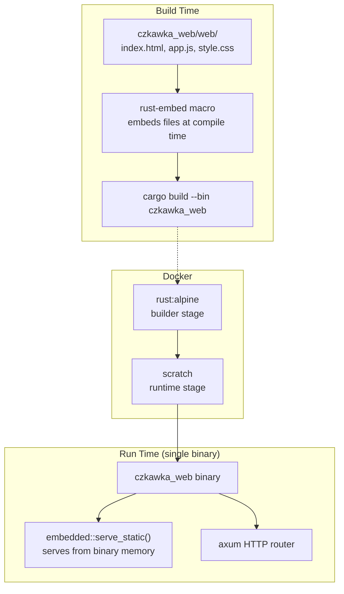
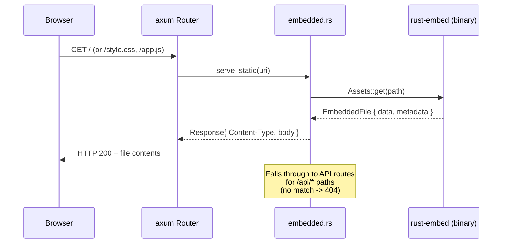

# Czkawka Web — Self-Contained Binary Plan

## Goal

Make `czkawka_web` a truly portable, self-contained binary by:
1. Embedding static web frontend files into the binary via `rust-embed`
2. Creating a minimal multi-stage Dockerfile
3. Adding `justfile` convenience recipes
4. Writing clear documentation

---

## Architecture Overview



---

## Data Flow



---

## File Changes

### 1. [`czkawka_web/Cargo.toml`](../czkawka_web/Cargo.toml)

**Add** `rust-embed` dependency. **Remove** the `fs` feature from `tower-http` (no longer needed since we stop using `ServeDir`).

```toml
[package]
name = "czkawka_web"
version = "11.0.1"
edition = "2024"

[[bin]]
name = "czkawka_web"
path = "src/main.rs"

[dependencies]
czkawka_core = { path = "../czkawka_core" }
axum = { version = "0.8", features = ["macros", "ws"] }
tokio = { version = "1", features = ["full"] }
tower-http = { version = "0.6", features = ["cors"] }          # <-- removed "fs"
serde = { version = "1", features = ["derive"] }
serde_json = "1"
futures-util = "0.3"
tracing = "0.1"
tracing-subscriber = "0.3"
crossbeam-channel = "0.5"
uuid = { version = "1", features = ["v4"] }
image = "0.25"
itertools = "0.14"
rust-embed = "8"                                                # <-- NEW
```

Key points:
- `rust-embed = "8"` — latest stable, pure Rust, no non-Rust deps
- No extra features needed; we'll write a thin axum handler manually
- `tower-http` keeps `cors` since `CorsLayer` is still used

---

### 2. [`czkawka_web/src/embedded.rs`](../czkawka_web/src/embedded.rs) — **NEW FILE**

A small module that wraps `rust-embed` and provides an axum-compatible handler.

```rust
use axum::http::{header, StatusCode, Uri};
use axum::response::{IntoResponse, Response};
use rust_embed::Embed;

/// Compile-time embedded static files from the `web/` directory.
///
/// The `#[folder]` path is relative to `czkawka_web/Cargo.toml` (the crate root),
/// which is where `cargo build` is invoked from within the workspace.
#[derive(Embed)]
#[folder = "web/"]
struct Assets;

/// Serve a static file from the embedded archive.
///
/// - `/` or empty path → `index.html`
/// - `/style.css` → `style.css`
/// - `/app.js` → `app.js`
/// - anything else → 404
pub(crate) async fn serve_static(uri: Uri) -> Response {
    let path = uri.path().trim_start_matches('/');

    // Normalise: empty path or "/" maps to index.html.
    let path = if path.is_empty() || path == "/" {
        "index.html"
    } else {
        path
    };

    match Assets::get(path) {
        Some(content) => {
            let mime = mime_type(path);
            (
                StatusCode::OK,
                [(header::CONTENT_TYPE, mime)],
                content.data.to_vec(),
            )
                .into_response()
        }
        None => (
            StatusCode::NOT_FOUND,
            [(header::CONTENT_TYPE, "text/plain; charset=utf-8")],
            b"404 Not Found".to_vec(),
        )
            .into_response(),
    }
}

/// Map file extension to MIME type.
///
/// Only the extensions actually used by the czkawka_web frontend are listed.
/// Falls back to `application/octet-stream` for unknown extensions.
fn mime_type(path: &str) -> &'static str {
    if path.ends_with(".html") {
        "text/html; charset=utf-8"
    } else if path.ends_with(".js") {
        "text/javascript; charset=utf-8"
    } else if path.ends_with(".css") {
        "text/css; charset=utf-8"
    } else if path.ends_with(".svg") {
        "image/svg+xml"
    } else if path.ends_with(".png") {
        "image/png"
    } else {
        "application/octet-stream"
    }
}
```

**Design rationale:**
- Manual MIME mapping avoids pulling in `mime_guess` (~30 deps) for just 3-4 file types.
- `to_vec()` converts `Cow<'static, [u8]>` into `Vec<u8>` which axum 0.8 natively converts into a `Body`.
- The function signature matches `axum::routing::get(embedded::serve_static)` perfectly.

---

### 3. [`czkawka_web/src/main.rs`](../czkawka_web/src/main.rs)

Two changes:
1. Add `mod embedded;` at the top.
2. Replace `.fallback_service(ServeDir::new("czkawka_web/web"))` with `.fallback(get(embedded::serve_static))`.

Remove the `ServeDir` import since it's no longer used.

```rust
mod api;
mod embedded;          // <-- NEW
mod scan_manager;
mod ws;

use std::net::SocketAddr;
use std::sync::Arc;

use axum::routing::{get, post};
use axum::Router;
use czkawka_core::common::config_cache_path::set_config_cache_path;
use tower_http::cors::CorsLayer;
// ^-- ServeDir removed

use crate::api::scan::AppState;
use crate::scan_manager::ScanManager;

#[tokio::main]
async fn main() {
    tracing_subscriber::fmt()
        .with_max_level(tracing::Level::INFO)
        .init();

    let _ = set_config_cache_path("Czkawka", "CzkawkaWeb");

    let state = AppState {
        scan_manager: Arc::new(ScanManager::new()),
    };

    let app = Router::new()
        .route("/api/scan/duplicates", post(api::scan::scan_duplicates))
        .route("/api/scan/hardlink", post(api::scan::scan_hardlink))
        .route("/api/scan/similar-images", post(api::scan::scan_similar_images))
        .route("/api/scan/similar-videos", post(api::scan::scan_similar_videos))
        .route("/api/preview/image", get(api::preview::image_preview))
        .route("/api/preview/video", get(api::preview::video_preview))
        .route("/api/results/{scan_id}", get(api::results::get_results))
        .route("/api/scan/progress/{scan_id}", get(ws::ws_handler))
        .route("/api/files/delete", post(api::actions::delete_files))
        .route("/api/files/hardlink", post(api::actions::hardlink_files))
        .layer(CorsLayer::permissive())
        .fallback(get(embedded::serve_static))  // <-- CHANGED
        .with_state(state);

    let port = std::env::var("CZKAWKA_PORT")
        .ok()
        .and_then(|p| p.parse::<u16>().ok())
        .unwrap_or(8095);
    let addr = SocketAddr::from(([127, 0, 0, 1], port));
    tracing::info!("Czkawka Web Server starting on http://{addr}");

    let listener = tokio::net::TcpListener::bind(addr)
        .await
        .expect("Failed to bind to address");
    axum::serve(listener, app).await.expect("Server error");
}
```

**Why `get(embedded::serve_static)` and not a `fallback_service`?**
Because `embedded::serve_static` is an axum handler (async function returning `impl IntoResponse`), it integrates directly with the router. `fallback_service` expects a tower `Service`, while `fallback(get(...))` expects a handler — cleaner and no extra tower wrapper needed.

---

### 4. [`czkawka_web/Dockerfile`](../czkawka_web/Dockerfile) — **NEW FILE**

```dockerfile
# syntax=docker/dockerfile:1
# Multi-stage build for czkawka_web
#
# Build stage: rust:alpine compiles the binary with embedded assets.
# Runtime stage: scratch (empty) image contains only the binary.

# ======================================================
# Stage 1: Builder
# ======================================================
FROM rust:alpine AS builder

# Install build-time system dependencies.
# musl-dev and openssl-dev are needed by some transitive Rust deps.
RUN apk add --no-cache musl-dev openssl-dev

WORKDIR /app

# Copy only manifests and lockfile first — maximises Docker layer caching.
COPY Cargo.toml Cargo.lock ./
COPY czkawka_core/Cargo.toml czkawka_core/
COPY czkawka_web/Cargo.toml czkawka_web/

# Create dummy source files so `cargo build` can resolve and cache dependencies.
RUN mkdir -p czkawka_core/src czkawka_web/src \
    && echo "fn main() {}" > czkawka_core/src/lib.rs \
    && echo "fn main() {}" > czkawka_web/src/main.rs \
    && echo "pub mod api; pub mod embedded; pub mod scan_manager; pub mod ws;" > czkawka_web/src/lib.rs \
    && echo "pub mod mod_api_internal; mod internal { pub(crate) mod actions; pub(crate) mod preview; pub(crate) mod results; pub(crate) mod scan; }" > czkawka_web/src/api/mod.rs \
    && mkdir -p czkawka_web/web \
    && echo "<html></html>" > czkawka_web/web/index.html \
    && echo "" > czkawka_web/web/style.css \
    && echo "" > czkawka_web/web/app.js

# Build dependencies only (cached layer).
RUN cargo build --package czkawka_web --release 2>/dev/null || true

# Now copy the real source.
COPY czkawka_core/src czkawka_core/src/
COPY czkawka_web/ czkawka_web/

# Touch the src files to force a rebuild of the actual crate code.
RUN touch czkawka_web/src/main.rs czkawka_core/src/lib.rs

# Build the actual binary.
RUN cargo build --package czkawka_web --release

# Strip debug symbols for minimal size.
RUN strip /app/target/release/czkawka_web

# ======================================================
# Stage 2: Runtime
# ======================================================
FROM scratch

COPY --from=builder /app/target/release/czkawka_web /czkawka_web

# The server binds to 127.0.0.1:8095 by default.
# Override with CZKAWKA_PORT env var at runtime.
EXPOSE 8095

ENTRYPOINT ["/czkawka_web"]
```

**Design rationale:**
- `rust:alpine` — minimal Rust builder image (~200 MB vs `rust:slim`'s ~500 MB).
- `scratch` runtime — truly minimal final image (~10 MB for the binary alone).
- Cargo dependency caching via dummy source files avoids rebuilding 100+ crates on every code change.
- `strip` removes debug symbols (~50% size reduction for release binary).

---

### 5. [`czkawka_web/.dockerignore`](../czkawka_web/.dockerignore) — **NEW FILE**

```text
target/
.git/
*.md
.gitignore
```

Keeps the Docker build context small by excluding build artifacts and git metadata.

---

### 6. [`justfile`](../justfile)

Add two new recipes at the end of the file (before the final newline):

```makefile
##################### WEB #####################

# Build czkawka_web binary with embedded static files.
build-web:
    cargo build --release --bin czkawka_web

# Build and run czkawka_web in development mode.
run-web:
    cargo run --bin czkawka_web

# Build and run czkawka_web with fast_release profile.
runr-web:
    cargo run --profile fast_release --bin czkawka_web

# Build the Docker image for czkawka_web.
docker-web:
    docker build -t czkawka_web -f czkawka_web/Dockerfile .

# Run the Docker image (maps port 8095).
docker-run-web:
    docker run -p 8095:8095 --rm czkawka_web
```

Placement: after the Android section, before the Benchmark section (around line 224). This groups web-related recipes together and follows the existing pattern of section comments like `##################### ANDROID #####################`.

---

### 7. [`czkawka_web/README.md`](../czkawka_web/README.md) — **NEW FILE**

```markdown
# czkawka_web — Web GUI for Czkawka

A lightweight web-based interface for the Czkawka file cleaning tools. Runs as a
standalone HTTP server with an embedded frontend — no external files needed at runtime.

## Quick Start

### From source

```bash
# Build (from workspace root)
cargo build --release --bin czkawka_web

# Run
cargo run --release --bin czkawka_web
```

Or using `just`:

```bash
just build-web
just run-web       # debug profile
just runr-web      # fast_release profile
```

Open [http://127.0.0.1:8095](http://127.0.0.1:8095) in your browser.

### Using Docker

```bash
# Build the image
just docker-web

# Or manually:
docker build -t czkawka_web -f czkawka_web/Dockerfile .

# Run
docker run -p 8095:8095 --rm czkawka_web
```

## Configuration

| Environment variable | Default     | Description                     |
|----------------------|-------------|---------------------------------|
| `CZKAWKA_PORT`       | `8095`      | TCP port for the HTTP server    |

The server binds to `127.0.0.1` by default. To change the address, modify the `SocketAddr`
in `src/main.rs` or set a reverse proxy (e.g. nginx, Caddy) in front of it.

## API Endpoints

| Method | Path                            | Description                  |
|--------|---------------------------------|------------------------------|
| POST   | `/api/scan/duplicates`          | Scan for duplicate files     |
| POST   | `/api/scan/similar-images`      | Scan for similar images      |
| POST   | `/api/scan/similar-videos`      | Scan for similar videos      |
| GET    | `/api/preview/image?path=...`   | Image thumbnail preview      |
| GET    | `/api/preview/video?path=...`   | Video thumbnail preview      |
| GET    | `/api/results/{scan_id}`        | Get scan results             |
| GET    | `/api/scan/progress/{scan_id}`  | WebSocket progress stream    |
| POST   | `/api/files/delete`             | Delete selected files        |
| POST   | `/api/files/hardlink`           | Hard-link selected files     |

## Development

### Frontend

The frontend is a vanilla JS single-page application in `web/`:

- `web/index.html` — main page structure
- `web/app.js` — application logic (872 lines)
- `web/style.css` — dark theme styles

To rebuild the binary after frontend changes:

```bash
cargo build --release --bin czkawka_web
```

No bundler or build step is needed — the files are embedded at compile time via
[`rust-embed`](https://crates.io/crates/rust-embed).

### Adding new static files

1. Place the file in `czkawka_web/web/`.
2. Add a MIME type mapping in [`src/embedded.rs`](src/embedded.rs) if the extension is new.
3. Rebuild the binary.

## Project Structure

```
czkawka_web/
├── Cargo.toml          # Crate manifest
├── Dockerfile          # Multi-stage Docker build
├── README.md           # This file
├── src/
│   ├── main.rs         # Server setup, routing
│   ├── embedded.rs     # Static file embedding (rust-embed)
│   ├── scan_manager.rs # Scan lifecycle management
│   ├── ws.rs           # WebSocket progress handler
│   └── api/
│       ├── mod.rs
│       ├── actions.rs  # File delete/hardlink
│       ├── preview.rs  # Image/video previews
│       ├── results.rs  # Scan result retrieval
│       └── scan.rs     # Scan initiation
└── web/
    ├── index.html      # Frontend HTML
    ├── app.js          # Frontend JS
    └── style.css       # Frontend CSS
```
```

---

## Build & Test Workflow

### Local build and verify

```bash
# 1. Build the binary
cargo build --release --bin czkawka_web

# 2. Run from ANY directory to verify self-containment
cd /tmp
/path/to/czkawka/target/release/czkawka_web &
curl -s http://127.0.0.1:8095/ | head -c 100   # should return HTML
curl -s http://127.0.0.1:8095/style.css | head -c 100
curl -s http://127.0.0.1:8095/app.js | head -c 100
kill %1

# 3. Verify that running from a random directory still works
mkdir -p /tmp/czkawka_test && cd /tmp/czkawka_test
/path/to/czkawka/target/release/czkawka_web &
curl -s http://127.0.0.1:8095/ | grep -q "Czkawka" && echo "PASS: serves HTML from random dir"
kill %1

# 4. Docker build and verify
docker build -t czkawka_web -f czkawka_web/Dockerfile .
docker run -d -p 8095:8095 --name czkawka_web_test czkawka_web
curl -s http://127.0.0.1:8095/ | grep -q "Czkawka" && echo "PASS: Docker container serves HTML"
docker stop czkawka_web_test && docker rm czkawka_web_test

# 5. Run the fix gate
just fix
```

### Expected behavior after changes

| Scenario | Before (current) | After |
|----------|------------------|-------|
| `./czkawka_web` from workspace root | ✅ Works | ✅ Works |
| `./czkawka_web` from `/tmp/` | ❌ Fails (no `czkawka_web/web/` at path) | ✅ Works |
| `docker run czkawka_web` | ❌ No Dockerfile | ✅ Works |
| `just run-web` | ❌ No recipe | ✅ Builds + runs |
| `just build-web` | ❌ No recipe | ✅ Builds |

---

## Risk Assessment

| Risk | Mitigation |
|------|-----------|
| `rust-embed` API changes | Pinned to `"8"` in Cargo.toml; breakage would be caught by CI |
| Large binary due to embedded files | Combined size of web/ files is ~30 KB — negligible overhead |
| Docker build cache invalidation | Cargo dependency caching via dummy source files in the builder stage |
| MIME type missing for new frontend files | `mime_type()` function is easy to extend; fallback to `application/octet-stream` is safe |
| Path traversal via URI | `rust-embed`'s `get()` only returns files that were embedded at compile time — no filesystem access at all, so path traversal is impossible by design |
