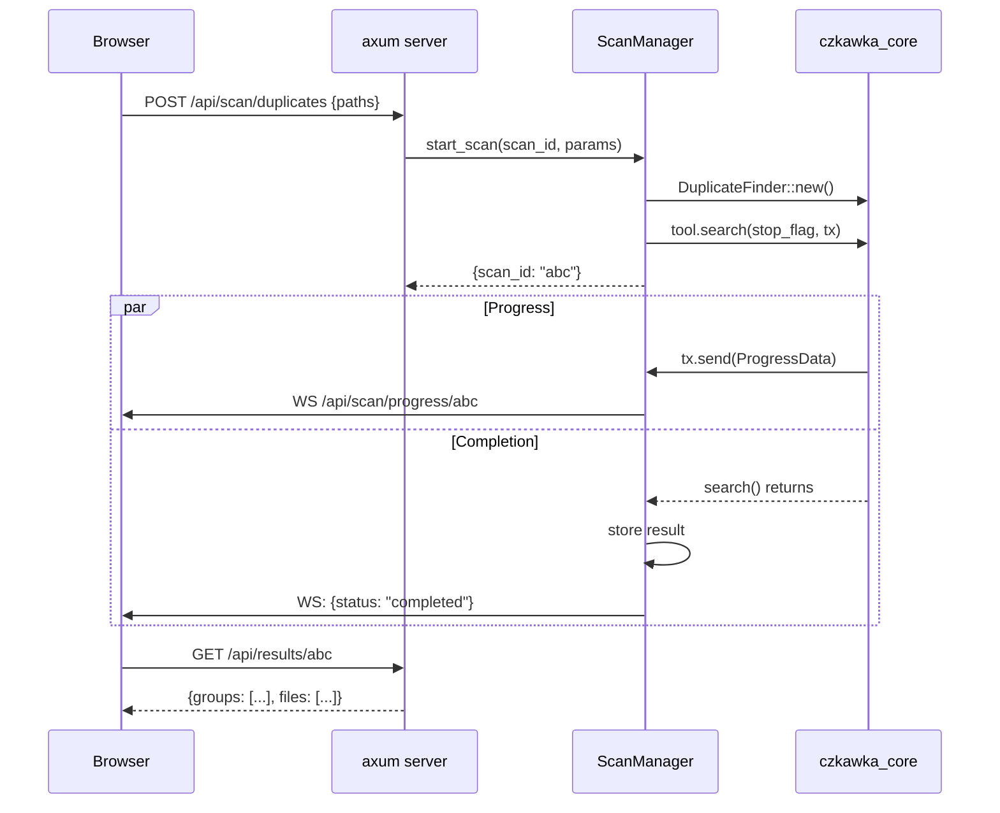

# Czkawka Web Server – Implementation Plan

## Goal
A lightweight HTTP server that runs in the background and allows controlling Czkawka scanning via REST API + Web UI in a browser. It complements the existing GUI, does not replace it.

---

## Architecture

```
┌──────────┐   HTTP REST    ┌───────────────────────────┐
│ Browser  │ ◄───────────►  │ czkawka_web server       │
│  (UI)    │                │ ┌───────────────────────┐ │
│          │   WebSocket    │ │  axum HTTP server     │ │
│          │ ◄───────────►  │ │  (runs on localhost)  │ │
└──────────┘                │ ├───────────────────────┤ │
                            │ │  ScanManager          │ │
                            │ │  ┌─────────────────┐ │ │
                            │ │  │ czkawka_core    │ │ │
                            │ │  └─────────────────┘ │ │
                            │ ├───────────────────────┤ │
                            │ │  Static files         │ │
                            │ │  (web UI embedded)    │ │
                            │ └───────────────────────┘ │
                            └───────────────────────────┘
```

---

## Cargo workspace – new `czkawka_web` crate

**File:** `czkawka_web/Cargo.toml`
```toml
[package]
name = "czkawka_web"
version.workspace = true
edition.workspace = true

[dependencies]
czkawka_core = { path = "../czkawka_core" }
axum = "0.8"
tokio = { version = "1", features = ["full"] }
tower-http = { version = "0.6", features = ["cors", "fs"] }
serde = { version = "1", features = ["derive"] }
serde_json = "1"
tracing = "0.1"
tracing-subscriber = "0.3"
```

**Add to workspace** in `Cargo.toml`:
```toml
members = [
    ...
    "czkawka_web",
]
```

---

## REST API endpoints

### Scanning

| Method | Path | Description |
|--------|------|-------------|
| `POST` | `/api/scan/duplicates` | Start duplicate scan |
| `POST` | `/api/scan/similar-images` | Start similar images scan |
| `POST` | `/api/scan/empty-folders` | Start empty folders scan |
| `POST` | `/api/scan/empty-files` | Start empty files scan |
| `POST` | `/api/scan/big-files` | Start big files scan |
| `POST` | `/api/scan/temporary` | Start temporary files scan |
| `POST` | `/api/scan/similar-videos` | Start similar videos scan |
| `POST` | `/api/scan/similar-music` | Start similar music scan |
| `POST` | `/api/scan/invalid-symlinks` | Start invalid symlinks scan |
| `POST` | `/api/scan/broken-files` | Start broken files scan |
| `POST` | `/api/scan/bad-extensions` | Start bad extensions scan |
| `POST` | `/api/scan/bad-names` | Start bad names scan |
| `POST` | `/api/scan/exif-remover` | Start EXIF data scan |
| `POST` | `/api/scan/video-optimizer` | Start video optimizer scan |
| `GET` | `/api/scan/stop` | Stop a running scan |

**Request body (POST):**
```json
{
    "included_paths": ["/home/user/Downloads"],
    "excluded_paths": ["/home/user/Downloads/temp"],
    "recursive": true,
    "min_file_size": 1024,
    "max_file_size": 1073741824,
    "tool_settings": { }
}
```

**Response:**
```json
{
    "scan_id": "uuid-1234",
    "status": "started"
}
```

### Progress (WebSocket)

| Endpoint | Description |
|----------|-------------|
| `WS` | `/api/scan/progress/{scan_id}` | Real-time progress events |

**WebSocket message:**
```json
{
    "stage": "hashing_files",
    "current": 42,
    "total": 1000,
    "current_size": 1048576,
    "total_size": 83886080,
    "percentage": 4.2
}
```

### Results

| Method | Path | Description |
|--------|------|-------------|
| `GET` | `/api/results/{scan_id}` | Returns scan results as JSON |
| `DELETE` | `/api/results/{scan_id}` | Deletes scan results |

### File actions

| Method | Path | Description |
|--------|------|-------------|
| `POST` | `/api/files/delete` | Delete selected files |
| `POST` | `/api/files/move` | Move selected files |

---

## Crate structure

```
czkawka_web/
├── Cargo.toml
└── src/
    ├── main.rs           ← axum server setup, routing
    ├── scan_manager.rs   ← ScanManager – starts and tracks scans
    │                       (holds Arc<Mutex<HashMap<scan_id, ScanState>>>)
    ├── api/
    │   ├── mod.rs
    │   ├── scan.rs       ← POST /api/scan/* handlers
    │   ├── results.rs    ← GET/DELETE /api/results/*
    │   └── actions.rs    ← POST /api/files/*
    ├── ws.rs             ← WebSocket handler for progress
    └── errors.rs         ← API error types
```

---

## ScanManager – key component

```rust
struct ScanManager {
    scans: Arc<Mutex<HashMap<String, ScanState>>>,
}

struct ScanState {
    stop_flag: Arc<AtomicBool>,
    progress_tx: crossbeam_channel::Sender<ProgressData>,
    result: Option<Box<dyn PrintResults + Send>>,
    status: ScanStatus,
}

enum ScanStatus {
    Running,
    Completed,
    Failed(String),
}
```

Each scan runs in a separate `tokio::task::spawn_blocking` thread (because czkawka_core uses rayon and a synchronous API).

---

## Web UI (minimalistic, embedded)

A single HTML page + JS + CSS, embedded directly into the binary via `include_str!`:

```
czkawka_web/src/web/
├── index.html     ← main page
├── app.js         ← vanilla JS (no framework – lightweight)
└── style.css      ← simple dark theme
```

Or for a nicer UI – Svelte (smallest framework):
```
czkawka_web/web-ui/
├── package.json
├── src/
│   ├── App.svelte
│   ├── components/
│   │   ├── ScanForm.svelte
│   │   ├── ResultsTable.svelte
│   │   └── ProgressBar.svelte
│   └── main.js
└── build.sh        ← npm build + copy to src/web/
```

**UI includes:**
- Tool selection (tabs like in krokiet)
- Add/remove paths
- Scan button + progress bar
- Results table (sorting, filtering)
- Delete/Move buttons

---

## Implementation milestones

| # | Milestone | What's needed | Time |
|---|-----------|--------------|------|
| 1 | **HTTP server + ScanManager** | axum, tokio, scan_manager.rs | ~1h |
| 2 | **API endpoints for scanning** | api/scan.rs – 1 endpoint per tool | ~1h |
| 3 | **WebSocket progress** | ws.rs + progress forwarding | ~30min |
| 4 | **API for results + actions** | api/results.rs, api/actions.rs | ~30min |
| 5 | **Web UI – basics** | index.html + app.js | ~1h |
| 6 | **Web UI – results table** | display, sorting, filtering | ~1h |
| 7 | **Remaining tools** | getting all 14 tools working | ~1h |
| 8 | **Testing + polish** | | ~1h |

**Total:** ~7–8 hours for a functional prototype.

---

## Usage

```bash
# Build + run
cargo run --bin czkawka_web

# Server runs on http://localhost:8080
# Open browser and go
```

Optional arguments:
```bash
czkawka_web --port 3000 --host 0.0.0.0
```

---

## What is shared with existing code

| Component | Sharing |
|-----------|---------|
| `czkawka_core` | ✅ Entire – unchanged |
| `ProgressData`, `CurrentStage` | ✅ Directly from czkawka_core |
| `flc!` macro for translations | ✅ Can be used |
| Krokiet connect_* handlers | ❌ Tied to Slint – must write new ones |

---

## Data flow diagram


