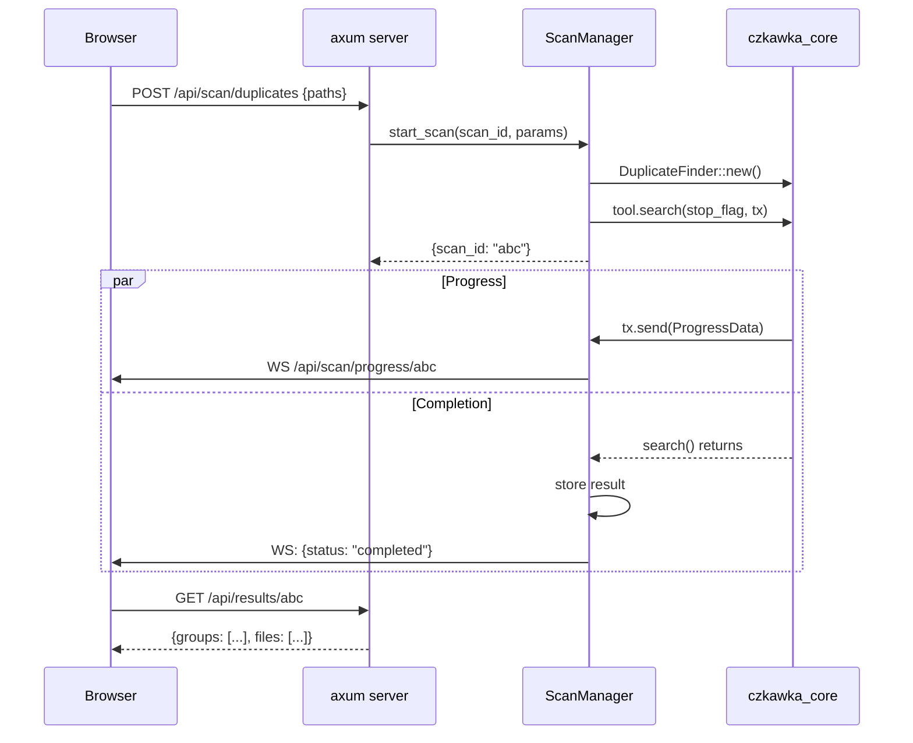

# Czkawka Web Server – plán implementace

## Cíl
Lehký HTTP server, který běží na pozadí a umožňuje ovládat Czkawka scanování přes REST API + Web UI v prohlížeči. Doplňuje stávající GUI, nenahrazuje ho.

---

## Architektura

```
┌──────────┐   HTTP REST    ┌───────────────────────────┐
│ Prohlížeč│ ◄───────────►  │ czkawka_web server       │
│  (UI)    │                │ ┌───────────────────────┐ │
│          │   WebSocket    │ │  axum HTTP server     │ │
│          │ ◄───────────►  │ │  (běží na localhost)  │ │
└──────────┘                │ ├───────────────────────┤ │
                             │ │  ScanManager          │ │
                             │ │  ┌─────────────────┐ │ │
                             │ │  │ czkawka_core    │ │ │
                             │ │  └─────────────────┘ │ │
                             │ ├───────────────────────┤ │
                             │ │  Static files         │ │
                             │ │  (web UI embedded)    │ │
                             │ └───────────────────────┘ │
                             └───────────────────────────┘
```

---

## Cargo workspace – nový crate `czkawka_web`

**Soubor:** `czkawka_web/Cargo.toml`
```toml
[package]
name = "czkawka_web"
version.workspace = true
edition.workspace = true

[dependencies]
czkawka_core = { path = "../czkawka_core" }
axum = "0.8"
tokio = { version = "1", features = ["full"] }
tower-http = { version = "0.6", features = ["cors", "fs"] }
serde = { version = "1", features = ["derive"] }
serde_json = "1"
tracing = "0.1"
tracing-subscriber = "0.3"
```

**Přidat do workspace** v `Cargo.toml`:
```toml
members = [
    ...
    "czkawka_web",
]
```

---

## REST API endpointy

### Scanování

| Metoda | Cesta | Popis |
|--------|-------|-------|
| `POST` | `/api/scan/duplicates` | Spustí scan duplicit |
| `POST` | `/api/scan/similar-images` | Spustí scan podobných obrázků |
| `POST` | `/api/scan/empty-folders` | Spustí scan prázdných složek |
| `POST` | `/api/scan/empty-files` | Spustí scan prázdných souborů |
| `POST` | `/api/scan/big-files` | Spustí scan velkých souborů |
| `POST` | `/api/scan/temporary` | Spustí scan dočasných souborů |
| `POST` | `/api/scan/similar-videos` | Spustí scan podobných videí |
| `POST` | `/api/scan/similar-music` | Spustí scan podobné hudby |
| `POST` | `/api/scan/invalid-symlinks` | Spustí scan neplatných symlinků |
| `POST` | `/api/scan/broken-files` | Spustí scan poškozených souborů |
| `POST` | `/api/scan/bad-extensions` | Spustí scan špatných přípon |
| `POST` | `/api/scan/bad-names` | Spustí scan špatných názvů |
| `POST` | `/api/scan/exif-remover` | Spustí scan EXIF dat |
| `POST` | `/api/scan/video-optimizer` | Spustí scan videí k optimalizaci |
| `GET` | `/api/scan/stop` | Zastaví běžící scan |

**Request body (POST):**
```json
{
    "included_paths": ["/home/user/Downloads"],
    "excluded_paths": ["/home/user/Downloads/temp"],
    "recursive": true,
    "min_file_size": 1024,
    "max_file_size": 1073741824,
    "tool_settings": { }
}
```

**Response:**
```json
{
    "scan_id": "uuid-1234",
    "status": "started"
}
```

### Progress (WebSocket)

| Endpoint | Popis |
|----------|-------|
| `WS` | `/api/scan/progress/{scan_id}` | Real-time progress události |

**Zpráva z WebSocketu:**
```json
{
    "stage": "hashing_files",
    "current": 42,
    "total": 1000,
    "current_size": 1048576,
    "total_size": 83886080,
    "percentage": 4.2
}
```

### Výsledky

| Metoda | Cesta | Popis |
|--------|-------|-------|
| `GET` | `/api/results/{scan_id}` | Vrací výsledky scanu jako JSON |
| `DELETE` | `/api/results/{scan_id}` | Smaže výsledky scanu |

### Akce se soubory

| Metoda | Cesta | Popis |
|--------|-------|-------|
| `POST` | `/api/files/delete` | Smaže vybrané soubory |
| `POST` | `/api/files/move` | Přesune vybrané soubory |

---

## Struktura crate

```
czkawka_web/
├── Cargo.toml
└── src/
    ├── main.rs           ← axum server setup, routing
    ├── scan_manager.rs   ← ScanManager – spouští a trackuje scany
    │                       (drží Arc<Mutex<HashMap<scan_id, ScanState>>>)
    ├── api/
    │   ├── mod.rs
    │   ├── scan.rs       ← POST /api/scan/* handlery
    │   ├── results.rs    ← GET/DELETE /api/results/*
    │   └── actions.rs    ← POST /api/files/*
    ├── ws.rs             ← WebSocket handler pro progress
    └── errors.rs         ← API error types
```

---

## ScanManager – klíčová komponenta

```rust
struct ScanManager {
    scans: Arc<Mutex<HashMap<String, ScanState>>>,
}

struct ScanState {
    stop_flag: Arc<AtomicBool>,
    progress_tx: crossbeam_channel::Sender<ProgressData>,
    result: Option<Box<dyn PrintResults + Send>>,
    status: ScanStatus,
}

enum ScanStatus {
    Running,
    Completed,
    Failed(String),
}
```

Každý scan běží v samostatném `tokio::task::spawn_blocking` vlákně (protože czkawka_core používá rayon a synchrónní API).

---

## Web UI (minimalistické, embedded)

Jedna HTML stránka + JS + CSS, embedded přímo do binárky přes `include_str!`:

```
czkawka_web/src/web/
├── index.html     ← hlavní stránka
├── app.js         ← vanilla JS (žádný framework – lehké)
└── style.css      ← jednoduchý dark theme
```

Nebo pro hezčí UI – Svelte (nejmenší framework):
```
czkawka_web/web-ui/
├── package.json
├── src/
│   ├── App.svelte
│   ├── components/
│   │   ├── ScanForm.svelte
│   │   ├── ResultsTable.svelte
│   │   └── ProgressBar.svelte
│   └── main.js
└── build.sh        ← npm build + zkopírovat do src/web/
```

**UI obsahuje:**
- Výběr nástroje (taby jako v krokiet)
- Přidání/odebrání cest
- Scan tlačítko + progress bar
- Tabulka výsledků (řazení, filtrování)
- Tlačítka Delete/Move

---

## Milníky implementace

| # | Milník | Co je potřeba | Čas |
|---|--------|---------------|-----|
| 1 | **HTTP server + ScanManager** | axum, tokio, scan_manager.rs | ~1h |
| 2 | **API endpointy pro scan** | api/scan.rs – 1 endpoint na tool | ~1h |
| 3 | **WebSocket progress** | ws.rs + progress forwarding | ~30min |
| 4 | **API pro výsledky + akce** | api/results.rs, api/actions.rs | ~30min |
| 5 | **Web UI – základ** | index.html + app.js | ~1h |
| 6 | **Web UI – tabulka výsledků** | zobrazení, řazení, filtrování | ~1h |
| 7 | **Ostatní tools** | rozchození všech 14 toolů | ~1h |
| 8 | **Testování + dolaďování** | | ~1h |

**Celkem:** ~7–8 hodin na funkční prototyp.

---

## Použití

```bash
# Build + spuštění
cargo run --bin czkawka_web

# Server běží na http://localhost:8080
# Otevři prohlížeč a jdeš
```

Volitelné argumenty:
```bash
czkawka_web --port 3000 --host 0.0.0.0
```

---

## Co se sdílí s existujícím kódem

| Komponenta | Sdílení |
|-----------|---------|
| `czkawka_core` | ✅ Celý – beze změn |
| `ProgressData`, `CurrentStage` | ✅ Přímo z czkawka_core |
| `flc!` makro pro překlady | ✅ Lze použít |
| Krokiet connect_* handlery | ❌ Jsou vázané na Slint – musíme napsat nové |

---

## Diagram toku dat


